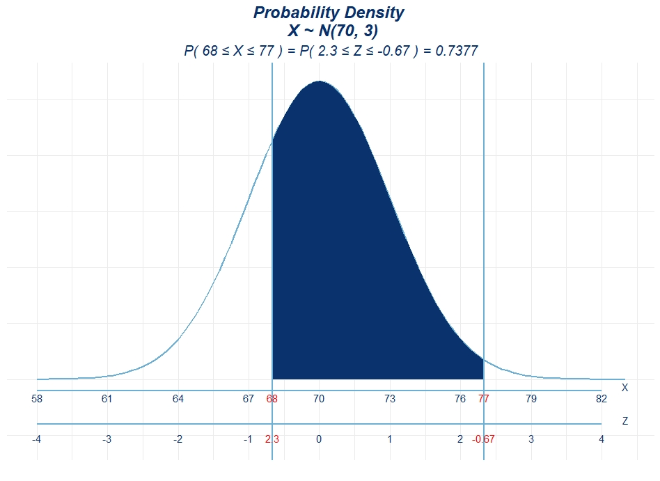

Probability Density Plot
------------------------

[Link to Shiny application](https://loankimrobinson.shinyapps.io/Probability_Density_Plot/)

This is function

``` r
library(ggplot2)
```

    ## Warning: package 'ggplot2' was built under R version 3.5.3

``` r
normal_prob_area_plot <- function(mean, sd, above= NULL, below = NULL, between = c(NULL, NULL), outside = c(NULL, NULL)){
  
  min <- -4*sd + mean
  max <-  4*sd + mean
  zscore <- function(i) {signif((i-mean)/sd,2)}
  area <-  function(i) {signif(pnorm(i, mean, sd),4)}
  
  
  if(!is.null(above)) {
    xlim <- xlim_1 <- c(above, max)
    ver <- above
    zscore_1 <- zscore(above)
    subtitle = paste0("P( X \u2265 ",ver," ) = ","P( Z \u2265 ",zscore(above)," ) = ",area(above))
    
  }else if(!is.null(below)){
    xlim <- xlim_1 <- c(min, below)
    ver <- below
    zscore_1 <- zscore(below)
    subtitle = paste0("P( X \u2264 ",ver," ) = ","P( Z \u2264 ",zscore(below)," ) = ", 1-area(below))
                      
  }else if(!is.null(between)){
    xlim <- xlim_1 <-  c(between[1], between[2])
    ver <- xlim
    zscore_1 <- c(zscore(between[2]), zscore(between[1]))
    subtitle = paste0("P( ",between[1]," \u2264 X \u2264 ",between[2]," ) = ",
                      "P( ",zscore(between[2])," \u2264 Z \u2264 ",zscore(between[1])," ) = ", area(between[2])-area(between[1]))

  }else if(!is.null(outside)){
    xlim <- c(min, outside[1])
    xlim_1 <-c(outside[2], max)
    ver <- c(outside[1],outside[2])
    zscore_1 <- c(zscore(outside[1]), zscore(outside[2]))
    subtitle = paste0("P( X \u2264 ",outside[1]," or X \u2265 ",outside[2]," ) = ",
                      "P( Z \u2264 ",zscore(outside[1])," or Z \u2265 ",zscore(outside[2])," ) = ", area(outside[2]) + (1 -area(outside[1])))
  }else{
    xlim <- c(min, max)
    ver <- NULL
  }
  ggplot(data.frame(x = c(min, max)), aes(x = x)) + 
    
    stat_function(fun = dnorm, args = list(mean = mean, sd = sd),color = "#6baed6",size=1) + 
    
    stat_function(fun = dnorm, args = list(mean = mean, sd = sd), xlim = xlim,
                  geom = "area", fill = "#08306b", alpha = .9,size=1) +
    
    stat_function(fun = dnorm, args = list(mean = mean, sd = sd), xlim = xlim_1,
                  geom = "area", fill = "#08306b", alpha = .9, size=1) +
    
    scale_x_continuous(name = "", breaks = seq(min, max, sd))+
    
    geom_vline(xintercept = ver, color = "#6baed6", size=1)+
    geom_text(aes(x=ver, label= ver, y=-0.008), colour="red") +
    geom_text(aes(x=ver, label= zscore_1, y=-0.026), colour="red") +
    
    coord_cartesian(clip="off")+
    theme(plot.margin = unit(c(1.5,1.5,5,1.5), "lines")) +
    
    annotate("segment",x = min, xend = max, y = -0.005, yend = -0.005,color = "#6baed6", size=0.8) +
    annotate("text",x = seq(min, max, sd),vjust = 0,label = seq(min, max, sd), y = -0.01,color = "#08306b") +
    annotate("text",x = max+1,vjust = 0, y = -0.005,label= "X",color = "#08306b") +
    
    annotate("segment",x = min, xend = max, y = -0.02, yend = -0.02,color = "#6baed6", size=0.8) +
    annotate("text",x = seq(min, max, sd),vjust = 0,label = seq(-4, 4, 1), y = -0.028,color = "#08306b") +
    annotate("text",x = max+1,vjust = 0, y = -0.02,label="Z",color = "#08306b") +
    
    labs(title=paste0("Probability Density \n X ~ N(",mean,", ",sd,")"),
         subtitle = subtitle)+
    theme_minimal()+
    theme(axis.text.x=element_blank(),
          axis.ticks.x=element_blank(),
          axis.text.y=element_blank(),
          axis.ticks.y=element_blank(),
          axis.title.y=element_blank(),
          plot.title = element_text(hjust = 0.5,color = "#08306b", size = 18, face = "bold.italic"),
          plot.subtitle = element_text(hjust = 0.5,color = "#08306b", size = 15, face = "italic"))
  
}
```

Example
-------





